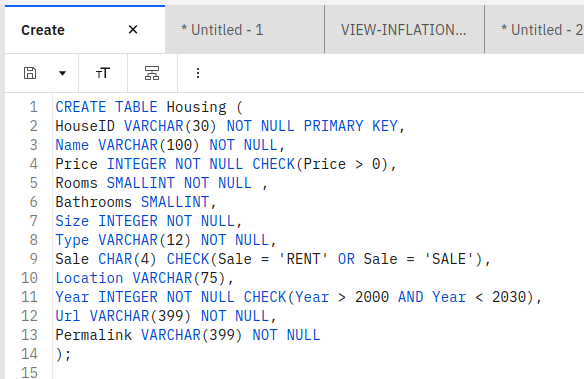

# 2015-2025 Guadalajara Real State Market Analysis

This repository contains a full implementation of the data lifecycle for the Guadalajara housing market. Covering extraction from over 65 web sources, cloud database administration, and a final Microsoft Power BI report with key conclusions.

## 📖 Table of Contents
- [Data Pipeline (technical)](#data-pipeline)
- [Database (technical)](#database-implementation)
- [Explained Analysis and Insights](#data-analysis)
- [Usage](#usage-and-requirements)

## Data Pipeline
This project ingests housing-market data in Guadalajara, Mexico, from 2015 through 2025, scraped from **69** URLs across multiple websites.

### Web Scraping and Data Transformation
- **Extraction:** is done with BeautifulSoup, processing the HTML from each website. Custom scraper functions handle each site’s unique (and often changing with time) structure.  
- **Transformation:** enforces data quality rules, ensuring only clean, analytics-ready records are saved to the database.  
- **Loading:** using IBM db2 login credentials the user needs to provide on a separate file, ETL.py saves new entries to the database.

### Apache Airflow
The Extract-Transform-Load process (ETL) in this project can be optionally used with Apache Airflow using the implementation in this repository. **The main advantage of using this is that the whole project from database to Power BI report will get updated frequently with the most recent data**. Moreover, Airflow provides scheduling, monitoring, and centralized logging of pipeline runs. 

The image below shows successful executions of the Airflow DAG. Populating the database for the first time will take longer than updating it.

The following image shows the latency at different stages of the pipeline. The extract section takes the longest due to all the requests and HTML processing.

## Database Implementation
For this project, an IBM db2 database solution was chosen and implemented. This cloud database makes the project very scalable, if used with Airflow this can easily become an analysis for more cities and more than 10 years. Additionally, it would allow teams of analysts and engineers to access the data with very high availability and would constitute a reliable production environment. In fact, the database was integrated to the Airflow pipeline and Power BI report.

1. **Main table** `Housing`— schema with little redundancy, further normalization is optional.  

2. **Analytics view** smaller view tailored for Power BI.  

3. **Inflation view** Calculates the Compound Annual Growth Rate (CAGR) by year for sales and there is another one for rents.

## Data Analysis
From the 69 considered sources I extracted a total of 1240 property data (2015-2025). Below is a summary of key findings, the full, longer report can be read on this repository in . The image below shows how this data is distributed across time (left) and the city (right).

### 10 year inflation
The most important metric measured on this work is the average yearly inflation of the price/m². I find this quantity is disproportionately higher for properties for rent than for sale. As seen in the image below, in this decade rents in Guadalajara experienced a 7.4% average yearly inflation compared to only 4.5% for sales.

### Can this be explained by national inflation?
To answer this question, I Calculated a simple average for inflation in the last 10 years in Mexico [Source](https://ycharts.com/indicators/mexico_inflation_rate_outlook_end_of_period_consumer_prices), the average yearly inflation was 4.85%. In fact, it was only above 7% during 2021 and 2022. Hence, properties for sale grew in value proportionally to inflation, but rents did not. **Rents did in fact get more expensive, potentially indicating higher demand.**

### Apartments vs Houses
Another interesting insight is how the price/m² depends on the type of property and location in the city. As supported by the image below, on average apartments have higher prices per square meter, and this difference has grown bigger recently. The slope of each curve suggests that recently houses are not growing in price as fast as apartments anymore. On the decision tree above one can interactively compare which locations are the most expensive each year if PowerBI is used.

### Neighborhoods
Which neighborhoods are the most expensive to rent or buy? Considering only locations with 10 or more properties and all the 10 years, the top 10 most expensive per square meter neighborhoods are the following.

### Final comments
From this analysis we can conclude:
- Rents in Guadalajara grew in value faster than inflation which didn't happen to sales.
- Apartments consistently have **higher price/m²** than houses.
- Recently, the price of houses for rent is not growing as fast as before, unlike apartments which keep getting more expensive.
- Locations like Av. Chapultepec, Country Club, Vallarta San Jorge are among the most expensive ones in the dataset.

## Usage And Requirements
The data used in the analysis is included on this repo [data](data.csv). If you intend to use this repository to extract your own data:

### Usage
- To use without Apache Airflow just execute ETL.py. You can change the URLs and need to provide database credentials if you want to save results.
- To use with Airflow put both AirflowDAG.py and ETL.py inside the DAGs folder of your Airflow.
- Info/Error logs and database commit history are saved to etl.log and history.sql in the path returned by os.getcwd() from the module os.

### Requirements 
- Python modules (tested with Python 3.10): os, requests, ibm_db, bs4 (BeautifulSoup), airflow (only if you use airflow), and common ones.
- Database credentials: Provided in a text file as given by db2. The path to them is defined in the variable Credentials.

### Considerations
- Links: Links are saved to variables named with the pattern "UrlN" where N is a number. Only the list Urls which contains some of them is used by the program. 
- Sources: Only Mercado Libre, Casas y terrenos, and Web Archive (Mercado Libre, Inmuebles24) are implemented. If they change their website structure the functions need to be updated. Only 2015, 2016, 2017, 2020, 2021, 2022 and May 2025 are tested.
